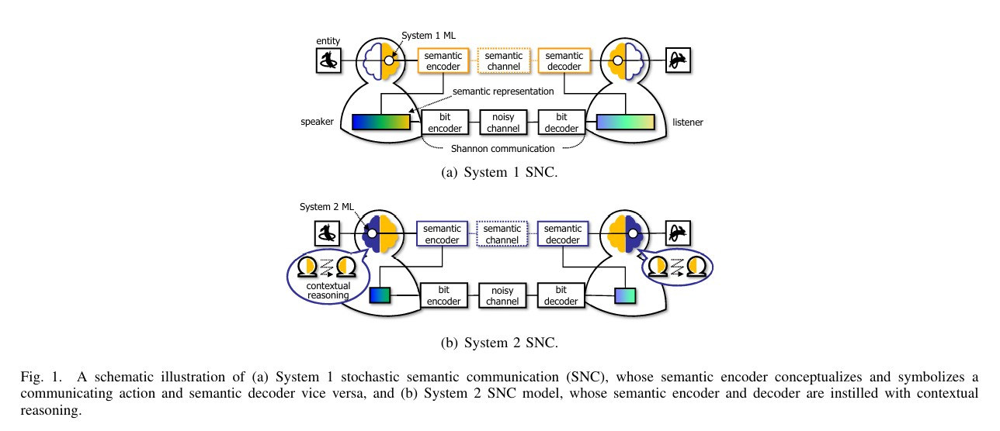
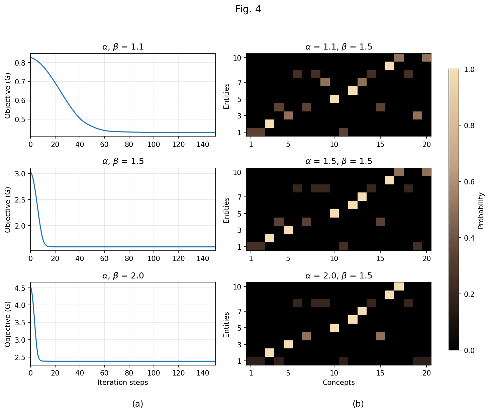
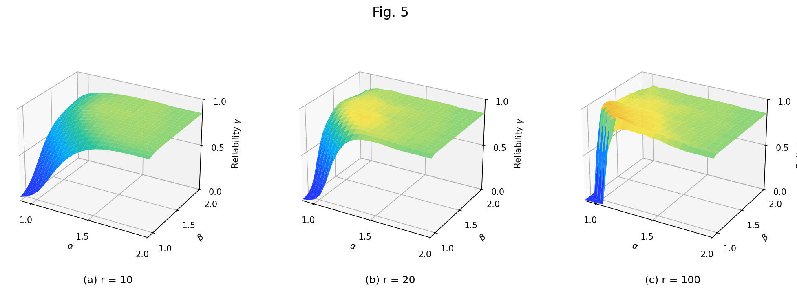
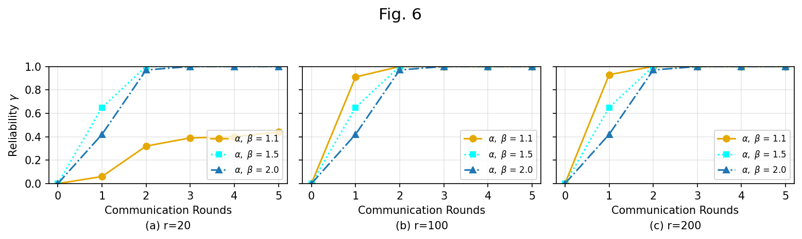
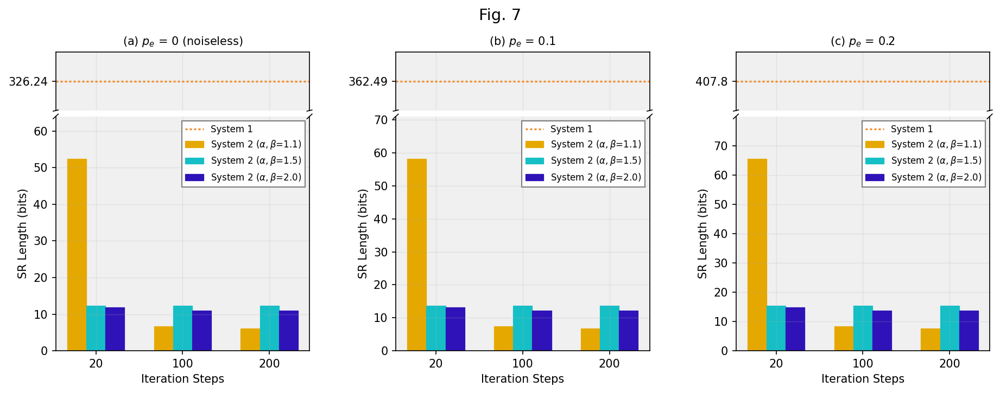
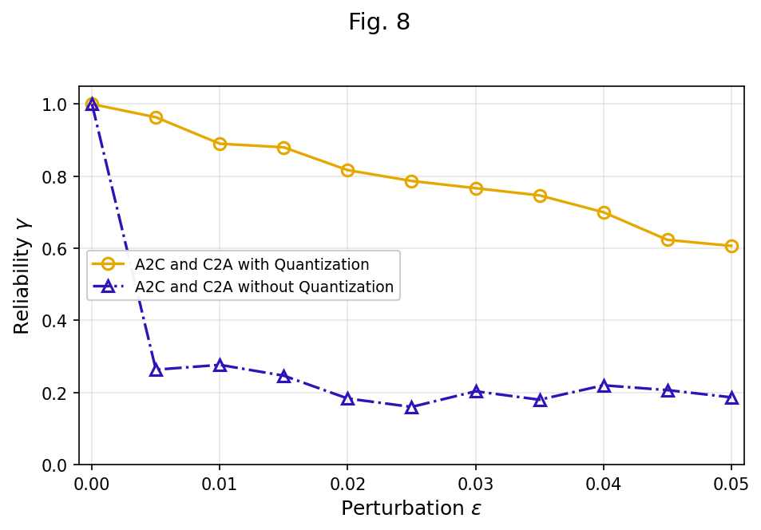

# SNC — Semantics-Native Communication via Contextual Reasoning
Implementation and experiment code for *[Semantics-Native Communication via Contextual Reasoning](https://ieeexplore.ieee.org/document/10054510)* 

## Architecture

## Usage

- Import `system1` and `system2` from the project root.
- Run scripts under `experiments/` (e.g. `python experiments/fig4.py`).

## Structure

- **`system1.py`** — System 1 SNC: Action–Concept Relevance, A2C/C2A, Concept–Symbol mapping, Theorem 1 (SR bit-length bounds)
- **`system2.py`** — System 2 SNC: Individual context (S, L), objective G, Self-SNC, Algorithm 1
- **`experiments/`**
  - `world.py` — World generation for Section IV experiments (|A|=|C|=100, Dirichlet, etc.)
  - `reliability.py` — System 1 vs System 2 reliability γ (Monte Carlo)
  - `fig4.py`–`fig8.py` — Scripts to reproduce paper Figures 4–8

## Results

Output figures from the experiment are stored in `results/` folder (Figures 4–8 from the paper).

| Figure | Description |
|--------|-------------|
| [Fig 4](results/fig4.png) | G convergence and stationary rA2C heatmap |
| [Fig 5](results/fig5.png) | Reliability γ vs α, β (3D surface; r = 10, 20, 100) |
| [Fig 6](results/fig6.png) | Reliability γ vs communication rounds |
| [Fig 7](results/fig7.png) | SR length achieving γ = 1 (System 1 vs System 2) |
| [Fig 8](results/fig8.png) | Robustness to asynchronous context (γ vs perturbation ε) |

Preview:

